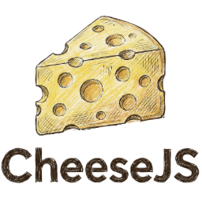

# CheeseJS 🧀

<p align="center">
  
</p>

**CheeseJS** es un playground moderno para JavaScript y TypeScript, ideal para prototipar, aprender y depurar código rápidamente. Transforma tu código usando Babel y muestra los resultados alineados junto a tu fuente.

---

## 🚀 Características

- **Ejecución en vivo** con retroalimentación instantánea
- **Resultados en línea**: Salida y errores alineados con tu código
- **Soporte Babel**: JavaScript moderno, TypeScript y propuestas
- **Protección de bucles**: Evita bloqueos por bucles infinitos
- **Temas y tamaño de fuente personalizables**
- **Barra lateral de configuración**: Opciones avanzadas de salida y alineación
- **i18n**: Soporte en inglés y español

---

## 🧑‍💻 Primeros pasos

1. **Instala** las dependencias:
   ```sh
   pnpm install
   ```
2. **Ejecuta** la app:
   ```sh
   pnpm dev
   ```
3. **Escribe código** en el editor y ¡mira los resultados al instante!

---

## 🤝 Contribuir

¡Las contribuciones son bienvenidas! Puedes abrir issues o enviar pull requests para mejorar CheeseJS.

---

## 🙏 Créditos y origen

CheeseJS es un fork del proyecto [JSRunner](https://github.com/maikCyphlock/jsrunner) de Maikol Douglas Aguilar Falcón. Este proyecto se basa en JSRunner, pero con nueva identidad, interfaz y funciones.

---

<sub>CheeseJS no está afiliado al proyecto original JSRunner. Todos los derechos de autor y marcas pertenecen a sus respectivos dueños.</sub>
