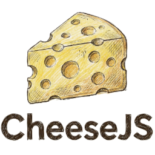

# CheeseJS 🧀

<p align="center">
	
</p>

**CheeseJS** is a modern playground for JavaScript and TypeScript, ideal for prototyping, learning, and debugging code quickly. It transforms your code using Babel and shows results aligned right next to your source.

---

## 🚀 Features

- **Live execution** with instant feedback
- **Inline results**: Output and errors aligned with your code
- **Babel support**: Modern JavaScript, TypeScript, and proposals
- **Loop protection**: Avoids freezes from infinite loops
- **Customizable themes and font size**
- **Settings sidebar**: Advanced output and alignment options
- **i18n**: English and Spanish support

---

## 🧑‍💻 Getting Started

1. **Install** dependencies:
	 ```sh
	 npm install
	 ```
2. **Run** the app:
	 ```sh
	 npm run dev
	 ```
3. **Write code** in the editor and see results instantly!

---

## 🤝 Contributing

Contributions are welcome! You can open issues or submit pull requests to improve CheeseJS.

---

## 🙏 Credits & Origin

CheeseJS is a fork of the excellent [JSRunner](https://github.com/maikCyphlock/jsrunner) project by Maikol Douglas Aguilar Falcón. This project builds upon JSRunner's foundation with a new identity, interface, and features.

---


<sub>CheeseJS is not affiliated with the original JSRunner project. All trademarks and copyrights belong to their respective owners.</sub>
